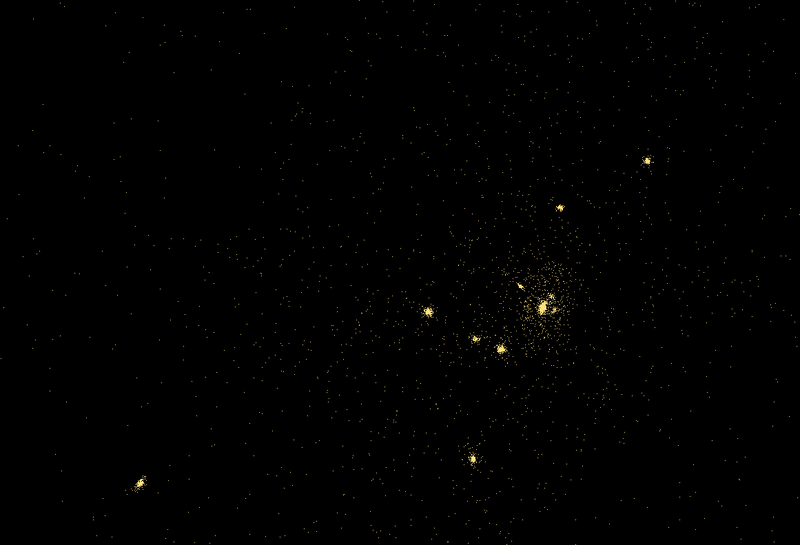

Last Modified by: Maythas Wangcharoenwong 20250410

# CURRENTLY IN THE PROCESS OF RE-WRITING README (WIP)
# N-body-simulator
----------
A visual particle simualtor 

----------
### About:
This project aims to Simulate interactions of N-bodies in using Particle-Particle Method implemented with `OpenGL` and `C++`. The project provides option to use either Compute Shaders written in `glsl` or simple CPU implementation.

----------
### Preface: 
This project is basically an educational project for me to learn how to properly use compute shaders, OpenGL, Post processing effects to make a visually stunning particle simulations. First, I must say that Physics is not my strong suit. With that given, the real aim of this project is to produce visually interesting simulation, not full physics accuracy (although I tried to be as accurate as possible). In a sense, the value in those of default test cases are extremely exaggerated so please be aware of this fact. As per the geometries of stellar clusters and how mass are mapped to colors, these are not fully accurate as well (To any physicist out there I am sorry (´；ω；｀)). With that being said, the project provides multiple controllable variables for those who want to try setup the simulation for themselves as well as multiple default test cases to pick from so enjoy!! (\*´ω｀\*)

----------
### Features:
- Velocity-Verlet and Euler Integrator
- Spawning cluster of bodies into multiple geometries such as discs and globular clusters.
- Although the project does not support taking arguments yet, setups can be done after launching the program.


<div align="center">
Default Test 12 
</div>

----------
### Geometries:

----------
### Build and Run
Simply use the scripts provided in `./QOL_Snippets` to build and run the program.

----------
### Setting up a simulation
Setting up a simulation is simple, you can either use one of the pre-written default tests or setting up the simulation manually. The steps are as follow.
1. run the run script
2. Answer the prompt accordingly <br>
    The input will be formatted in the following form. Each input value must be separated with the a space.
    ```
    Prompt here....
    <variable_1> <variable_2>
    :<your input value 1> <your input value 2> 
    ```
    After you finished writing down the values without `<>`, simply press enter.<br>
    In the case that the input is invalid, the prompt will be shown again.
    
3. Adding particles
   1. If you choose the manual setup, simply follow step 2 since the input format stays the same.
   2. If you choose default tests, you can simply pick the valid test based on the following. 
        
    ```
        Default test 0-4   : Test cases for CPU based setup (~1k particles)
        Default test 5-13  : Test cases for GPU based setup (~10k particles)
        Default test 14-22 : Test cases for GPU based setup (~20k-30k particles)
        Default test 23-33 : Test cases for GPU based setup (~40k+ particles)
    ```
4. The simulation will then being in a paused state, simply press `p` to begin

----------
### Controls
Please refer to the `"Window Controls"` when running the program.

|Controls|Action|
|-------------------------------|-------------------------------------------------------------------------------------------------------|
|esc                            | exit simulation                                                                                       |
|h                              | display controls on the console.                                                                      |
|p                              | pause / continue the simulation.                                                                      |
|i                              | display setup log.                                                                                    |
|o                              | toggle orbit / free-flying mode.                                                                      |
|r                              | reset camera to origin.                                                                               |
|k                              | toggle instancing.                                                                                    |
|f                              | toggle wireframe mode.                                                                                |
|b                              | toggle bloom.                                                                                         |
|m                              | toggle mass-size.                                                                                     |
|c                              | toggle mass-color.                                                                                    |
|n                              | toggle GUI.                                                                                           |
|middle mouse drag + left shift | pan the camera in the mouse drag direction.                                                           |
|middle mouse drag + left ctrl  | zoom in/out by dragging mouse forward and vice versa. (free-flying mode: move forward / backwards.)   |
|middle mouse drag              | orbit the camera about the center in the mouse drag direction. (free-flying mode: rotate the center.) |
|middle mouse scroll            | same action as middle mouse drag.                                                                     |        


※ps. mass-size and wireframe mode only shows when instancing is on
----------
### Known Issues


----------
### Performance

----------
### Examples 


<div align="center">
Default Test 24 
</div>
<br>


<div align="center">
Default Test 25
</div>
<br>


<div align="center">
Default Test 30 
</div>
