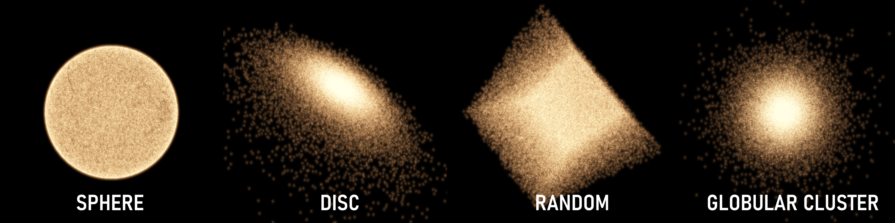
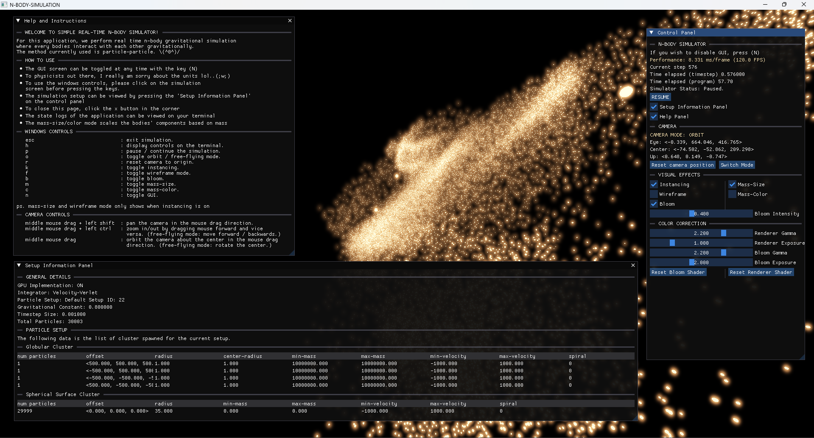

Last Modified by: Maythas Wangcharoenwong 20250411

# CURRENTLY IN THE PROCESS OF RE-WRITING README (WIP) THE IMAGES HERE ARE STILL OLD VERSIONS BTW
# N-body-simulator

A visual simulation engine for simulating the interactions of large cluster of celestial bodies in real-time.
<br>
<br>
**Aims:** This project aims to Simulate interactions of N-bodies in using Particle-Particle Method implemented with `OpenGL` and `C++`. The project provides option to use either GPU Compute Shaders written in `glsl` or simple CPU implementation.

### System requirements: 
- Windows 10-11
- Driver / GPU that supports OpenGL Version 4.3+
- Cmake (If you want to build it on your own)

## Preface: 
This project is basically an educational project for me to learn how to properly use compute shaders, OpenGL, Post processing effects to make a visually stunning particle simulations. First, I must say that Physics is not my strong suit. With that given, the real aim of this project is to produce visually interesting simulation, not full physics accuracy (although I tried to be as accurate as possible). In a sense, the value in those of default test cases are extremely exaggerated so please be aware of this fact. As per the geometries of stellar clusters and how mass are mapped to colors, these are not fully accurate as well (To any physicist out there I am sorry (´；ω；｀)). With that being said, the project provides multiple controllable variables for those who want to try setup the simulation for themselves as well as multiple default test cases to pick from so enjoy!! (\*´ω｀\*)
<br> 
<br>
For the write up of the implementation process, please visit this article on my website here　(｀･ω･´)ゞ !! \<TBD\>


<div align="center">
Default Test 12 
</div>
<br>

----------
## Features:
- Velocity-Verlet and Euler Integrator
- Dual mode camera for orbiting and free-flying
- Bloom (post-processing)
- Mass-Size/Color particle mapping
- CLI setup system
- GUI for setting effects and reading informations
- Spawning cluster of bodies into multiple geometries such as discs and globular clusters.
- GPU Acceleration for particle-particle method.


<div align="center">
Cluster Types
</div>
<br>

----------
## Performance: 
The performance test is done solely on my machine which uses RTX 4070 Ti GPU so just use this as a reference.

The FPS are written in format \<Effects ON - Effects OFF\>. These numbers should give a rough idea on how it should perform given this specific hardware. 

| # Particles / Implementation (FPS)        | CPU Naive Particle-Particle | GPU Naive Particle-Particle | GPU Tiling Particle-Particle| GPU Fine-Grain Particle-Particle |
|-----------------------------|---------|----------|------------|---------|
|n = 100                      | 120     | 120      |120         |120      |  
|n = 1000                     | 90-91   | 120      |120         |120      |
|n = 10000                    | 1       | 120      |120         |120      |
|n = 30000                    | -       | 120      |120         |120      |
|n = 50000                    | -       | 88 ~ 100 |117 ~ 120   |109 ~ 120|
|n = 65000                    | -       | 57 ~ 63  |66 ~ 74     |68  ~ 75 |
|n = 100000                   | -       | 23 ~ 23  |37 ~ 40     |30 ~ 32  |
|n = 150000                   | -       | 12 ~ 12  |17 ~ 18     |14 ~ 14  |
|n = 200000                   | -       | 7 ~ 7    |8 ~ 8       |8 ~ 8    |


----------
## Instructions

### Running the program
If you don't want to build your own executable, there is one available under `release` directory. 

Make sure the program `N_body_simulator.exe` is ran when the directory structure looks like this. This is mandatory because I didn't bake the shaders into the program, in-case anyone want to edit for fun (plus its easier to debug this way.)

```
│   N_body_simulator.exe
│
└───shader_source
    │   light.fs
    │   light.vs
    │   update_position_euler.comp
    │   update_position_velocity_verlet.comp
    │   update_position_velocity_verlet_optimize_fine.comp
    │   update_position_velocity_verlet_optimize_tile.comp
    │
    └───bloom
            bloom_combine.fs
            bloom_combine.vs
            gaussian_blur.fs
            gaussian_blur.vs
```


### Build and Run
Simply use the scripts provided in `./QOL_Snippets` to build and run the program. For the release version, you can use `build.bat` to built the program 

In case that there are some compatibility issues when building, you might want to try the `CMakeLists.txt` version under `release/archive`

### Setting up a simulation
Setting up a simulation is simple, you can either use one of the pre-written default tests or setting up the simulation manually. The steps are as follow.
1. run the run script
2. Answer the prompt accordingly <br>
    The input will be formatted in the following form. Each input value must be separated with the a space.
    ```
    Prompt here....
    <variable_1> <variable_2>
    :<your input value 1> <your input value 2> 
    ```
    After you finished writing down the values without `<>`, simply press enter.<br>
    In the case that the input is invalid, the prompt will be shown again.
    
3. Adding particles
   1. If you choose the manual setup, simply follow step 2 since the input format stays the same.
   2. If you choose default tests, you can simply pick the valid test based on the following. 
        
    ```
        Default test 0-4   : Test cases for CPU based setup (~1k particles)
        Default test 5-13  : Test cases for GPU based setup (~10k particles)
        Default test 14-22 : Test cases for GPU based setup (~20k-30k particles)
        Default test 23-33 : Test cases for GPU based setup (~40k+ particles)
        Default test 34-36 : Test cases for GPU based setup (~50k-150k particles)
    ```
4. The simulation will then being in a paused state, simply press `p` to begin

## Controls
Please refer to the `"Window Controls"` or the GUI help menu when running the program.


<div align="center">
GUI Example
</div>
<br>

### Window Controls
To use these hotkeys, please make sure you are focusing on the simulation screen.

|Controls|Action|
|-------------------------------|-------------------------------------------------------------------------------------------------------|
|esc                            | exit simulation                                                                                       |
|h                              | display controls on the console.                                                                      |
|p                              | pause / continue the simulation.                                                                      |
|i                              | display setup log.                                                                                    |
|o                              | toggle orbit / free-flying mode.                                                                      |
|r                              | reset camera to origin.                                                                               |
|k                              | toggle instancing.                                                                                    |
|f                              | toggle wireframe mode.                                                                                |
|b                              | toggle bloom.                                                                                         |
|m                              | toggle mass-size.                                                                                     |
|c                              | toggle mass-color.                                                                                    |
|n                              | toggle GUI.                                                                                           |

### Camera Controls
To use these camera controls, please make sure you are focusing on the simulation screen.

|Controls|Action|
|-------------------------------|-------------------------------------------------------------------------------------------------------|
|middle mouse drag + left shift | pan the camera in the mouse drag direction.                                                           |
|middle mouse drag + left ctrl  | zoom in/out by dragging mouse forward and vice versa. (free-flying mode: move forward / backwards.)   |
|middle mouse drag              | orbit the camera about the center in the mouse drag direction. (free-flying mode: rotate the center.) |
|middle mouse scroll            | same action as middle mouse drag.                                                                     |        

※ps. mass-size and wireframe mode only shows when instancing is on
<br>
※ps2. The random geometry is basically a cube (might need to add more variables)

----------
## Examples 


<div align="center">
Default Test 24 
</div>
<br>


<div align="center">
Default Test 25
</div>
<br>


<div align="center">
Default Test 30 
</div>

----------
## Future Implementations (Maybe one day...)
- Further optimization on the particle interaction calculations (use oct-tree, FMM...)
- More effects?
- Save-Load system

### Known Issues
- If you set the force or mass to some crazy stuffs and you start to see some void ball in the middle of your screen, fear not for the stuffs is actually flying off the camera limit... 😂 \[Will need to set world boundary probably]
- The sphere is sampled using `glm::sphericalRand` so there is a gaping hole and a line on some position...

----------
## References
